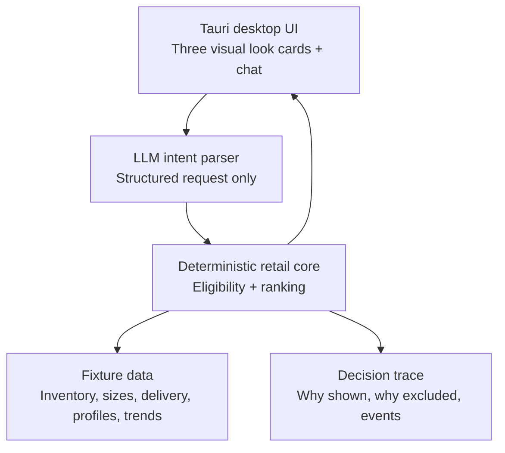

# Conversational Fashion Dark Store — Precedent Research

**Research date:** 29 August 2026
**Current contract:** [Specs v001](specs-v001.md)

**Historical input:** [D01 — Problem Statement](archive/prd-executable-specs/D01-problem-statement.md)
**Purpose:** Identify credible product precedents for a desktop mock that recommends fashion inventory available from a local dark store, lets a shopper refine through conversation, and turns the result into a shoppable action.

## Premise Check

The proposed experience is directionally credible: established commerce products already combine natural-language shopping questions, personalised recommendation, product discovery, and direct shopping actions. Amazon is the closest interaction precedent; Zalando is the closest fashion-discovery precedent; Instacart is the closest local-availability and fulfilment precedent.

There is no evidence here of a mature, public product that combines all three in exactly the requested form: **fashion + dark-store-local inventory + conversational recommendation**. The proposed mock should therefore be framed as a deliberate hybrid, not as a copy of an existing product.

Two assumptions need correction:

1. A language model does not make inventory, price, size, or delivery promises reliable. Those are retail-system facts and must be filtered and validated by the application before cards are shown.
2. “Current trends” should be a low-weight inspiration signal, not a reason to override explicit shopper need, fit, budget, or availability. The brief does not yet define a trend data source or how freshness will be controlled.

The reference to a “Jipper API” is not defined in the problem statement. This research therefore treats it as an unspecified external API and makes no claim about its capabilities.

## Expert Lenses

| Lens | Question it owns |
| --- | --- |
| Fashion-discovery product | Can a shopper express an occasion or style need in ordinary language and refine a useful shortlist? |
| Local-commerce operator | Are every recommendation, price, size, and delivery promise grounded in a current store-level snapshot? |
| Conversational-recommender researcher | When should the system ask a question instead of immediately recommending? |
| Trust and privacy reviewer | Can the shopper understand, correct, and control the information shaping personalisation? |
| Skeptical product engineer | Which impressive-looking capabilities merely hide missing data, false precision, or a fragile demo? |

## Product Precedents

| Precedent | What is established | What to borrow | What not to infer |
| --- | --- | --- | --- |
| [Amazon Rufus / Alexa for Shopping](https://www.aboutamazon.com/news/retail/amazon-rufus) | A chat layer can support occasion-led discovery, comparisons, product-level questions, suggested follow-ups, and a return to conventional results in the same shopping experience. | Keep chat attached to shopping, not as a separate assistant; show suggested questions and shoppable results. | Amazon’s catalogue, review corpus, and behavioural data are not available to this prototype. Amazon also explicitly said early generative responses will not always be correct. |
| [Zalando Fashion Assistant](https://corporate.zalando.com/en/technology/zalando-launch-fashion-assistant-powered-chatgpt) | A shopper can state a fashion situation in their own words—for example, a wedding in a particular place and month—and receive an explanation, relevant products, and an ongoing refinement conversation. | Make the first free-text input occasion-aware: event, time, weather, budget, colour, style, and size can be extracted or clarified. | Zalando described a beta and future possibilities, not evidence that every fashion conversation reliably finds a good outfit. |
| [Instacart Smart Shop](https://investors.instacart.com/news-releases/news-release-details/instacart-launches-ai-powered-smart-shop-technology-and-new) | Preference inference is combined with editable explicit preferences; when confidence is low, the product asks a clarifying question. | Ask one high-information question only when the system cannot confidently rank a viable set. Let the shopper correct preferences. | Grocery dietary preferences are not the same as fashion taste, fit, or body-sensitive information. |
| [Instacart AI Assistant](https://company.instacart.com/updates/instacarts-ai-assistant-powered-by-14-years-of-grocery-expertise) | A shopping assistant can turn an intent into a ready-to-buy cart using live local inventory, and can offer alternatives when a preferred item is unavailable. | Treat local fulfilment as a first-class eligibility filter before conversation wording or visual ranking. | Grocery substitution rules do not transfer directly to fashion; a substitute garment must meet style, size, and occasion constraints. |
| [Conversational recommender-system survey](https://arxiv.org/abs/2101.09459) | Conversation can make preference elicitation explicit and supports question selection, multi-turn recommendation, and evaluation as distinct design problems. | Measure whether a follow-up question improves a recommendation rather than treating every extra turn as beneficial. | The survey does not prescribe three cards, a specific UI, or a particular commercial metric. |

### Precedent details that change the design

- **Stay in the shopping surface.** Amazon describes its assistant as part of the same shopping experience and exposes suggested follow-ups; its early interface could be dismissed back to standard results. This supports a product grid that remains visible while chat refines it, rather than a full-screen text-only bot. [Amazon announcement](https://www.aboutamazon.com/news/retail/amazon-rufus)
- **Use an occasion as a compact intent object.** Zalando’s published example turns “What should I wear for a wedding in Santorini in July?” into an explanation and relevant fashion products, with room for further refinement and, potentially, known size availability. That is close to the requested “I am looking for ABC” handoff. [Zalando announcement](https://corporate.zalando.com/en/technology/zalando-launch-fashion-assistant-powered-chatgpt)
- **Ask when confidence is low; do not interrogate by default.** Instacart describes asking a clarifying question when its confidence in an inferred preference is low, while also supporting customer-editable declared preferences. This is a sound interaction hypothesis for the mock, though it should be validated with users. [Instacart Smart Shop](https://investors.instacart.com/news-releases/news-release-details/instacart-launches-ai-powered-smart-shop-technology-and-new)
- **Inventory is the bridge from conversation to commerce.** Instacart’s current assistant describes creating a cart from live local inventory, and its public material acknowledges that availability changes frequently. For a dark store, this means availability and delivery eligibility must be refreshed/represented as a timestamped source of truth, not narrated by the model. [Instacart assistant](https://company.instacart.com/updates/instacarts-ai-assistant-powered-by-14-years-of-grocery-expertise)
- **Natural language should acquire preferences, not silently invent them.** Conversational recommender-system literature identifies preference elicitation and multi-turn strategy as central problems. That supports a visible “Edit preferences” affordance and explicit chips for facts such as budget, size, colour, or occasion. [Gao et al., *Advances and Challenges in Conversational Recommender Systems*](https://arxiv.org/abs/2101.09459)

## Candidate Approaches

| Approach | Experience | Strength | Main failure mode |
| --- | --- | --- | --- |
| Conventional catalogue chatbot | Text chat first; results appear after several turns. | Familiar and easy to explain. | Chat becomes a detour; the shopper cannot scan or compare products fast enough. |
| Feed-first personalisation | Three fashionable cards on entry, with little or no conversation. | Fast, visual, and demo-friendly. | It cannot recover when the opening assumptions are wrong or the shopper’s need changes. |
| Concierge interview | Ask several questions before showing fashion options. | Can collect detailed fit and style constraints. | High abandonment risk; it feels like a form, not discovery. |
| **Inventory-bound conversational rack** | Start with three shoppable cards; retain chat and suggested refinements; ask one question only when it materially improves the viable selection. | Combines fast browsing, recoverability, and honest fulfilment constraints. | Requires clean fixture data and a clear eligibility/ranking boundary. |

## Chosen Thesis

Build the **inventory-bound conversational rack**.

The opening experience should show three complete, purchasable style propositions—not merely three isolated SKUs—because the shopper is solving an occasion/identity problem. Each proposition can contain a hero garment plus complementary pieces, but it must be clear which items are actually available and purchasable.

Each card should surface:

- image, look name, total price, and constituent items;
- store-level availability, supported size(s), and delivery/pick-up promise;
- one concise reason code, such as “fits your dinner-out preference,” “under your ₹4,000 budget,” or “available in your saved size”; and
- direct actions: **View look**, **Choose size**, **Add to bag**, and **Looking for something else**.

When the shopper types a new need, the application should first produce a structured intent, retrieve only eligible inventory, and then decide whether one follow-up would materially change the ranking. Example:

> “I need something for a dinner tonight under ₹4,000.”

If no size is known and it eliminates most viable looks, ask “Which size should I filter to?” Otherwise, show the three best eligible looks immediately and expose refinement chips such as `More formal`, `Show darker colours`, `Under ₹3,000`, and `Different category`.

This is an **inference** from the precedents and recommender-system research, not a proven optimal interface. “Three” is a deliberately constrained prototype choice; it needs user testing against two, four, or a standard product grid.

## Recommended Prototype Boundary



The recommended boundary is:

| Layer | Owns | Must not own |
| --- | --- | --- |
| LLM | Extracting an intent, choosing whether a clarification is needed, and producing concise shopper-facing copy. | Deciding that an item exists, is in stock, fits, costs a particular amount, or can arrive at a particular time. |
| Retail core | Hard filters and ranking from inventory, price, size, delivery, preference, and trend fixtures. | Unbounded prose generation. |
| UI | Product cards, comparison, preference correction, direct purchase paths, and visible status. | Implicitly hiding unavailable items or presenting generated facts as catalogue facts. |

For a GPT-based prototype, use a schema-constrained intent response, validate product identifiers server-side, then let the retail core form the cards. OpenAI’s Structured Outputs can constrain a response to a supplied JSON Schema, but OpenAI also documents that this does not prevent mistakes within schema values. It is therefore a format guardrail, not an inventory-truth mechanism. [OpenAI Structured Outputs](https://openai.com/index/introducing-structured-outputs-in-the-api/)

### Minimum fixture model

The first mock needs no external retail integration if its fixtures preserve the same boundaries:

```text
ShopperProfile: declared_style_preferences, explicit_sizes, budget_band, consented_history
InventorySnapshot: store_id, captured_at, sku_id, size, sellable_quantity, price, delivery_window
Product: sku_id, image, category, colour, style_tags, occasion_tags, look_links
TrendSignal: tag, source, observed_at, confidence
Recommendation: look_id, eligible_skus, rank, reason_codes, exclusion_reasons
```

`captured_at`, `sellable_quantity`, and `delivery_window` are intentionally visible parts of the data model. A demo that simply calls an item “available now” without a source timestamp cannot explain how it would fail safely in production.

## Evidence and Verification

### Fact-checkable questions

| Question | Answer | Evidence |
| --- | --- | --- |
| Do public retail products support conversational product discovery and follow-up questions? | Yes. Amazon’s initial Rufus material describes occasion/purpose shopping, suggested questions, product comparisons, and product-level questions within its shopping experience. | [Amazon](https://www.aboutamazon.com/news/retail/amazon-rufus) |
| Is ordinary-language fashion intent a credible input? | Yes, as a product precedent. Zalando publicly described a fashion assistant that interprets a location-and-occasion query, returns products, and supports ongoing refinement. | [Zalando](https://corporate.zalando.com/en/technology/zalando-launch-fashion-assistant-powered-chatgpt) |
| Should the system always ask questions before recommending? | No. Conversational recommendation research identifies question selection as a design problem, while Instacart publicly describes clarifying only when confidence is low. | [Gao et al.](https://arxiv.org/abs/2101.09459), [Instacart](https://investors.instacart.com/news-releases/news-release-details/instacart-launches-ai-powered-smart-shop-technology-and-new) |
| Is a local-inventory constraint relevant rather than implementation detail? | Yes. The closest local-commerce precedent says it builds carts from live local inventory and notes frequently changing availability. Fashion-specific evidence is still missing. | [Instacart assistant](https://company.instacart.com/updates/instacarts-ai-assistant-powered-by-14-years-of-grocery-expertise) |
| Does schema-constrained model output make retail facts correct? | No. It can constrain output structure, but model-supplied values still need business-system validation. | [OpenAI](https://openai.com/index/introducing-structured-outputs-in-the-api/) |

### Skeptical challenge

The precedent set is persuasive about interaction patterns, but weak evidence for product-market fit in a fashion dark store. Amazon and Instacart have far richer catalogues, transaction histories, and fulfilment systems; their public materials are product announcements, not neutral causal studies. Zalando’s cited fashion assistant was announced as a beta, not a controlled proof that fashion chat increases conversion.

The smallest honest response is to treat this desktop application as a **testable product hypothesis**. Instrument it and compare it with a conventional browse/search baseline. The initial questions are:

1. Does the three-look entry point shorten time to a saved look or add-to-bag action?
2. When a shopper rejects the first set, which clarification most often recovers relevance: occasion, budget, size, colour, or formality?
3. How often does the retail core exclude a plausible item because of size, stock, or delivery eligibility?
4. Do shoppers understand and trust each displayed reason code?

## Final Synthesis

The desired product has real precedents, but its differentiation is not the presence of a chat box. It is the reliable conversion of a vague fashion need into **three immediately shoppable, locally deliverable looks**, with a low-friction route to refine the result when the initial recommendation is wrong.

For the mock, prove one narrow journey—for example, “an outfit for a dinner tonight under ₹4,000”—with fixture-backed local availability, clear reason codes, one optional high-value question, and a visible add-to-bag path. Keep model output inside the intent-and-explanation boundary; keep retail facts deterministic and auditable.

## Open Questions

1. Which customer segment and geography does the mock represent, and what delivery promise is realistic there?
2. Are inventory quantities, size variants, prices, and delivery slots available through a real source, or entirely authored fixtures?
3. What personalisation inputs are consented, visible to the shopper, and editable? Avoid inferring sensitive attributes from browsing history.
4. What is the initial trend source, update cadence, and failure mode when it is unavailable or stale?
5. Is the actual product goal higher conversion, faster product discovery, better inventory turn, higher basket value, or a learning prototype? The primary metric changes the ranking objective.

## Source URLs

1. Amazon — [Rufus announcement](https://www.aboutamazon.com/news/retail/amazon-rufus)
2. Zalando — [Fashion assistant powered by ChatGPT](https://corporate.zalando.com/en/technology/zalando-launch-fashion-assistant-powered-chatgpt)
3. Instacart — [Smart Shop launch](https://investors.instacart.com/news-releases/news-release-details/instacart-launches-ai-powered-smart-shop-technology-and-new)
4. Instacart — [AI assistant and live local inventory](https://company.instacart.com/updates/instacarts-ai-assistant-powered-by-14-years-of-grocery-expertise)
5. Gao, Lei, He, de Rijke, and Chua — [*Advances and Challenges in Conversational Recommender Systems: A Survey*](https://arxiv.org/abs/2101.09459)
6. OpenAI — [Structured Outputs in the API](https://openai.com/index/introducing-structured-outputs-in-the-api/)
